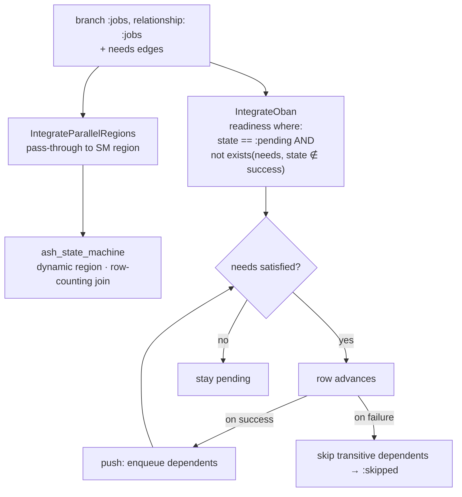

# RFC: needs-gated DAG workflows

**Status**: Draft **Author**: Barnabas Jovanovics **Created**: 2026-06-15
**Feedback deadline**: TBD

**Stakeholders**:

| Name        | Role       | Reviewed? | Concerns? |
| ----------- | ---------- | --------- | --------- |
| Barnabas J. | Maintainer | [ ]       |           |

## TL;DR

Build a GitHub-Actions-shaped DAG on top of `ash_jobs`: **relationship-sourced
branches** (fan out over a `has_many`, runtime cardinality — leaning on the
[dynamic parallel regions](../../../ash_state_machine/documentation/rfc/dynamic-parallel-regions.md)
work in `ash_state_machine`), **`needs` edges as data** on the rows, and
**edge-driven readiness** expressed as a trigger `where` filter so a row starts
only when all its `needs` have succeeded. Add **failure propagation** (skip
transitive dependents) and **runtime cycle detection**. This is the `ash_jobs`
half of the workflow DAG engine
([plan](../../../../documentation/plans/workflow-dag-engine.md)).

## Need / problem statement

`parallel_step` today fans out to a fixed compile-time set of `branch`
singletons and starts them **all at once** — there's no notion of one branch
waiting on a sibling. The workflow model needs:

1. fan-out width determined at runtime (N jobs from a workflow file);
2. ordering between siblings (`needs`), sequential by default, parallel where
   independent;
3. a failed upstream step to **skip** its dependents, not hang them;
4. cycles caught at runtime (no compile-time topological depth to lean on).

## Approach / proposed solution

### Overview

Four additive capabilities, layered on the dynamic-region primitive:

- **Relationship-sourced `branch`** — `branch :jobs, relationship: :jobs`,
  passed through `IntegrateParallelRegions` to a dynamic SM region.
- **`needs`-gated readiness** — each row carries a `needs` edge to siblings; the
  Oban trigger's `where` requires every `needs` to be in a success state before
  the row advances out of `:pending`.
- **Failure propagation** — on a row entering a failure state, transitively
  transition reverse-`needs` dependents to a new `:skipped` terminal state.
- **Cycle detection** — a runtime DAG check on fan-out; a cycle fails the parent
  region instead of deadlocking.

### Architecture

### Key design decisions

1. **`needs` is data, not DSL topology.** Edges live as a self-referential
   relationship between sibling rows (app data model). The DSL only names which
   relationship carries the edges. This is the RFC's "DAG as data" — it unifies
   with the dynamic-region fan-out: the `has_many` rows _are_ the nodes, the
   `needs` relationship _is_ the edge set.
2. **Readiness is a `where` filter, not a hand-rolled counter.** Reuse
   `IntegrateOban`'s `combine_where_exprs/2` + `build_state_where_expr/2` to AND
   a `not exists(needs, state not in <success states>)` clause onto the row's
   advance trigger. The success states come from the
   [terminal-state Info API](../../../ash_state_machine/documentation/rfc/dynamic-parallel-regions.md).
   This is **edge-driven readiness** — each row is ready the instant its own
   needs finish, the strategy the umbrella RFC prefers over layer-barrier.
3. **Poll + optional push.** The `where` filter alone is correct but
   poll-latency-bound; an after-success change walks the reverse edge and
   enqueues now-ready dependents for instant wake-up. Push is an optimisation on
   top of a correct poll, not a correctness requirement.
4. **Create doesn't bypass readiness.** `AshJobs.Change`'s create-trigger path
   must defer to the readiness `where` so a fanned-out row with unmet needs
   doesn't self-start on insert.
5. **`{:require_n, n}` compile-time bound is removed for dynamic branches** —
   it's unknowable without a compile-time branch count; enforcement moves to the
   coordinator's runtime check (the ash_state_machine RFC).

### API / interface changes

- `branch :name, relationship: :rel` (resource inferred); `resource` optional.
- A `needs` declaration naming the sibling edge relationship.
- A `:skipped` terminal state in the generated state machine.
- No change to static `branch :name, Resource` + sequential `step`.

### Data model changes

The library generates the `:skipped` state and the readiness trigger; the
**app** owns the `needs` edge resource, the `has_many`, `parent_id`, and
migrations.

## Benefits

- Sequential-by-default + parallel-where-independent falls out of the `where`
  filter — no scheduler rewrite.
- Edge-driven readiness for free from existing trigger plumbing.
- Failure-skip and cycle detection make the DAG safe to run unattended.

## Alternatives considered

### Alternative 1: layer-barrier scheduling (GitBlixt's model)

Collapse the graph into topological depth levels, run a level, barrier, advance.
Rejected: it over-synchronises (a job waits for its whole level, not just its
predecessors) — the exact win the `needs` graph promises, given up. See the
umbrella RFC's worked example.

### Alternative 2: hand-rolled readiness counter

Persist `pending_needs` per row, decrement on completion, enqueue at zero.
Rejected as the _primary_ mechanism: the trigger `where` already expresses
readiness declaratively; a counter is the push optimisation's bookkeeping, not
the source of truth.

### Do nothing

Stay with static `parallel_step` fan-out and `sort_order` sequencing — can't
express a runtime DAG.

## Risks and drawbacks

- **Readiness `where` correctness** — the `not exists(needs, …)` expression must
  use the right success-state set or rows start early/never. Covered by
  US-NGD-03 / US-NGD-07.
- **Failure-skip vs completion strategy** — skipped rows must count correctly
  against `:all` / `{:require_n}` (US-FP-04), else a run with one failure either
  hangs or wrongly "succeeds".
- **Cycles deadlock without detection** — every row waits on a row that waits
  back; runtime detection is mandatory, not optional (US-CYC-01..03).
- **Create self-trigger** — easy to miss that a bulk-created row self-starts
  before its needs (US-NGD-07).

## Cross-cutting concerns

- **Security**: cycle detection bounds execution; a malformed `needs` graph must
  fail fast, not exhaust resources (US-CYC-03).
- **Performance**: the readiness `where` runs an `exists` subquery per scheduler
  tick; push-on-completion cuts poll latency.
- **Observability**: operators see independent rows run concurrently (US-NGD-08)
  and failures surface as skips (US-FP-05).
- **Backwards compatibility**: static `branch` + sequential `step` unchanged
  (US-RSB-05).

## Open questions

- Where does cycle detection live — ash_jobs (over the `needs` DSL relationship)
  or ash_state_machine (over the row graph)? Leaning ash_jobs.
- Is push-on-completion in v1, or poll-only first with push as a follow-up?
- Does `needs` apply only to fanned-out rows, or also to sequential `step`s?

## References

- [Workflow DAG engine plan](../../../../documentation/plans/workflow-dag-engine.md)
- [workflow-actions-model RFC](../../../../documentation/rfc/workflow-actions-model.md)
- [dynamic-parallel-regions RFC](../../../ash_state_machine/documentation/rfc/dynamic-parallel-regions.md)
- Feature stories:
  [relationship-sourced-branches](../user/developer/relationship-sourced-branches/README.md),
  [needs-gated-dag](../user/developer/needs-gated-dag/README.md),
  [failure-propagation](../user/developer/failure-propagation/README.md),
  [cycle-detection](../user/developer/cycle-detection/README.md)

---

**Last Updated**: 2026-06-15
