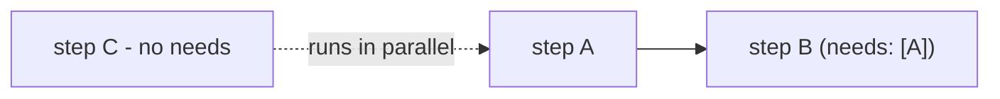

# needs-gated readiness (edge-driven DAG) — agent documentation

For an agent authoring a workflow, `needs` is the declarative surface for
ordering: state only what a row depends on (`needs: [A]`) and the engine derives
the rest. This is cheaper in tokens and context than a `sort_order` scheme —
there is no global numbering to keep consistent, no renumbering when a step is
inserted, and no need to hold the whole sequence in context to place one step.
Each edge is a local, self-describing fact ("B needs A") that the readiness
`where` turns into execution order, leaving everything unconnected free to run
in parallel. The agent expresses intent (dependencies); the engine owns
scheduling.

## Stories

| ID        | Story                                               | File                                                          |
| --------- | --------------------------------------------------- | ------------------------------------------------------------- |
| US-NGD-09 | Ordering is expressed via `needs`, not `sort_order` | [US-NGD-09](./US-NGD-09-ordering-via-needs-not-sort-order.md) |

## See also

- [needs-gated-dag RFC](../../../rfc/needs-gated-dag.md)
- [Workflow DAG engine plan](../../../../../../documentation/plans/workflow-dag-engine.md)
- [developer documentation](../../developer/needs-gated-dag/README.md)
- [operator documentation](../../operator/needs-gated-dag/README.md)
