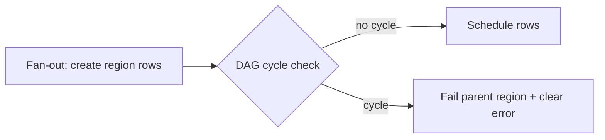

# Runtime cycle detection — developer documentation

Because `needs` edges are app data (a self-referential relationship over sibling
rows) rather than compile-time DSL topology, a cyclic graph can only be caught
at runtime. A DAG check on the fan-out path detects the cycle before any row is
scheduled and fails the parent region with a clear, named error — so a developer
sees an explicit failure instead of a deadlocked run where every row waits on a
sibling that waits back.

## Stories

| ID        | Story                                                       | File                                                       |
| --------- | ----------------------------------------------------------- | ---------------------------------------------------------- |
| US-CYC-01 | A cyclic `needs` graph is detected at fan-out               | [US-CYC-01](./US-CYC-01-detect-cycle-on-fan-out.md)        |
| US-CYC-02 | A detected cycle fails the parent region with a clear error | [US-CYC-02](./US-CYC-02-fail-parent-region-clear-error.md) |

## See also

- [needs-gated-dag RFC](../../../rfc/needs-gated-dag.md)
- [Workflow DAG engine plan](../../../../../../documentation/plans/workflow-dag-engine.md)
- [Security-engineer cycle-detection docs](../../security-engineer/cycle-detection/README.md)
