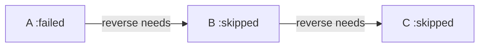

# Failure propagation — skip transitive dependents — developer documentation

When a workflow row enters a failure state, the `AshJobs.Change` after-action
pattern that advances a row on success gains a sibling that, on a failure
transition, walks the reverse `needs` edge and skips every downstream row. The
new `:skipped` state joins `:completed`/`:failed`/`:cancelled` as a generated
terminal state, and `check_group_completion/3` counts skipped rows so the
parent's completion strategy still resolves.

## Stories

| ID       | Story                                                                    | File                                                    |
| -------- | ------------------------------------------------------------------------ | ------------------------------------------------------- |
| US-FP-01 | When a row fails, its direct dependents are skipped, not started         | [US-FP-01](./US-FP-01-direct-dependents-skipped.md)     |
| US-FP-02 | Skips propagate transitively across the `needs` graph                    | [US-FP-02](./US-FP-02-transitive-skip-propagation.md)   |
| US-FP-03 | A `:skipped` terminal state is added to the generated state machine      | [US-FP-03](./US-FP-03-skipped-terminal-state.md)        |
| US-FP-04 | Skipped rows are counted correctly by `:all` / `{:require_n}` completion | [US-FP-04](./US-FP-04-skipped-counted-by-completion.md) |

## See also

- [needs-gated-dag RFC](../../../rfc/needs-gated-dag.md)
- [Workflow DAG engine plan](../../../../../../documentation/plans/workflow-dag-engine.md)
- [Operator documentation](../../operator/failure-propagation/README.md)
