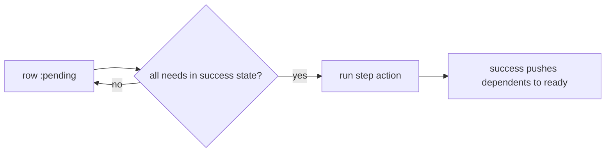

# needs-gated readiness (edge-driven DAG) — developer documentation

Each fanned-out row carries a `needs` edge to its sibling rows, so ordering
lives in the data rather than in a compile-time step list. The generated Oban
trigger's readiness `where` requires every `needs` to be in a success state
before a row advances out of `:pending` — sequential-by-default from one filter,
while independent rows (no edge between them) run in parallel for free. When a
need reaches success it can push its dependents to ready immediately; otherwise
the scheduler's periodic poll picks them up on the next pass. The gate is
assembled by the same seams the per-step state filter already uses
(`build_state_where_expr/2`, `combine_where_exprs/2`), so it is additive, not a
parallel code path.

## Stories

| ID        | Story                                                                 | File                                                        |
| --------- | --------------------------------------------------------------------- | ----------------------------------------------------------- |
| US-NGD-01 | Declare a `needs` dependency between sibling rows                     | [US-NGD-01](./US-NGD-01-declare-needs-edge.md)              |
| US-NGD-02 | A row with no `needs` becomes ready immediately                       | [US-NGD-02](./US-NGD-02-no-needs-ready-immediately.md)      |
| US-NGD-03 | A row starts only once all its `needs` reach a success state          | [US-NGD-03](./US-NGD-03-start-after-all-needs-success.md)   |
| US-NGD-04 | Independent rows run in parallel                                      | [US-NGD-04](./US-NGD-04-independent-rows-parallel.md)       |
| US-NGD-05 | A need reaching success pushes its dependents to ready (no poll wait) | [US-NGD-05](./US-NGD-05-success-pushes-dependents-ready.md) |
| US-NGD-06 | With push disabled, the scheduler poll still advances ready rows      | [US-NGD-06](./US-NGD-06-poll-advances-without-push.md)      |
| US-NGD-07 | A fanned-out row with unmet needs does not self-start on create       | [US-NGD-07](./US-NGD-07-unmet-needs-no-self-start.md)       |

## See also

- [needs-gated-dag RFC](../../../rfc/needs-gated-dag.md)
- [Workflow DAG engine plan](../../../../../../documentation/plans/workflow-dag-engine.md)
- [operator documentation](../../operator/needs-gated-dag/README.md)
- [agent documentation](../../agent/needs-gated-dag/README.md)
