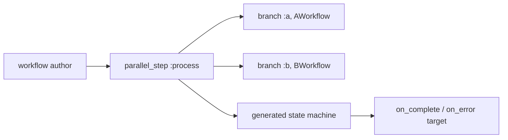

# Static parallel steps — developer documentation

`parallel_step` lets a workflow author fan out to a fixed set of branch
resources known at compile time. Each `branch :name, Resource` is a static branch:
the resource is required, Spark introspection exposes the branch entities, the
completion strategy is validated against the declared branch count, and optional
error routing stays part of the generated state machine.

## Stories

| ID        | Story                                                              | File                                                    |
| --------- | ------------------------------------------------------------------ | ------------------------------------------------------- |
| US-SPS-01 | Fixed-resource branches compile and remain introspectable          | [US-SPS-01](./US-SPS-01-fixed-branches-compile.md)      |
| US-SPS-02 | Static completion strategies are retained and validated            | [US-SPS-02](./US-SPS-02-completion-strategies.md)       |
| US-SPS-03 | Static parallel steps retain their `on_error` routing              | [US-SPS-03](./US-SPS-03-on-error-routing.md)            |

## See also

- [needs-gated-dag RFC](../../../rfc/needs-gated-dag.md)
- [relationship-sourced branches](../relationship-sourced-branches/README.md)
- [Workflow DAG engine plan](../../../../../../documentation/plans/workflow-dag-engine.md)
