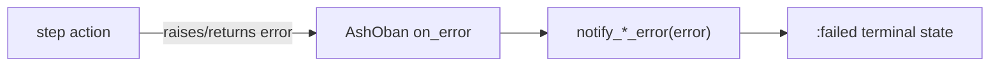

# Workflow error handling — developer documentation

AshJobs workflow authors can route a failed step to an error-handler step with
`on_error`. The handler action accepts an `:error` argument, may extract a useful
message from the payload, and completes the workflow through its `on_complete`
terminal transition. Handlers are valid from active workflow states; terminal
states are not reopened by calling additional handlers on the same record.

## Stories

| ID        | Story                                                        | File                                                |
| --------- | ------------------------------------------------------------ | --------------------------------------------------- |
| US-WEH-01 | Error-handler actions preserve payloads from valid states    | [US-WEH-01](./US-WEH-01-error-handler-payloads.md)  |

## See also

- [Workflow DAG engine plan](../../../../../../documentation/plans/workflow-dag-engine.md)
- [Operator workflow error handling](../../operator/workflow-error-handling/README.md)
