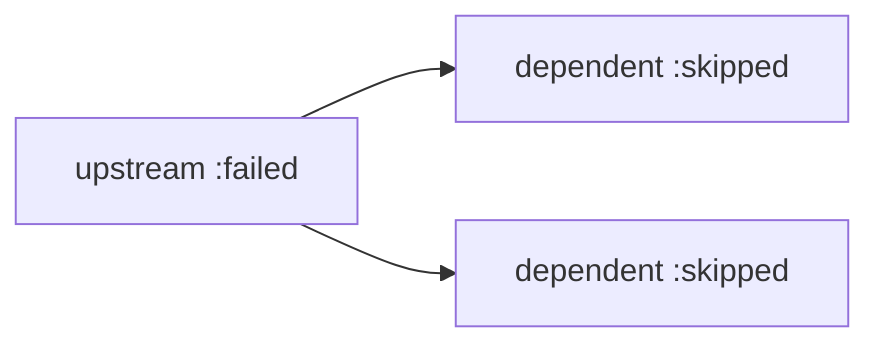

# Failure propagation — skip transitive dependents — operator documentation

When an upstream row fails partway through a DAG, its `needs` dependents would
otherwise sit in a non-terminal state forever, waiting on a row that will never
succeed. Failure propagation moves the whole reverse-`needs` closure to the
`:skipped` terminal state, so every row has a clear terminal disposition
(`:skipped` vs `:failed` vs `:completed`) when triaging a failed run, and the
parent's completion strategy resolves rather than hanging.

## Stories

| ID       | Story                                                                     | File                                                     |
| -------- | ------------------------------------------------------------------------- | -------------------------------------------------------- |
| US-FP-05 | A failed upstream row surfaces dependents as skipped, never stuck pending | [US-FP-05](./US-FP-05-dependents-never-stuck-pending.md) |

## See also

- [needs-gated-dag RFC](../../../rfc/needs-gated-dag.md)
- [Workflow DAG engine plan](../../../../../../documentation/plans/workflow-dag-engine.md)
- [Developer documentation](../../developer/failure-propagation/README.md)
