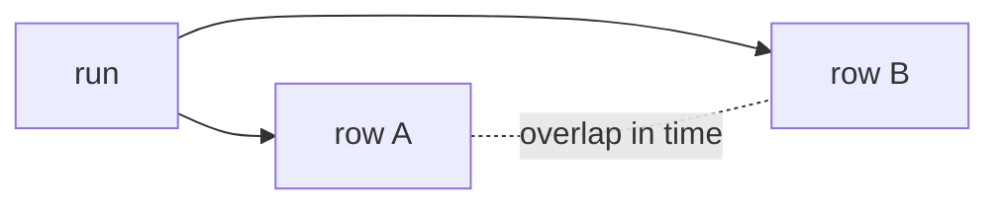

# needs-gated readiness (edge-driven DAG) — operator documentation

From an operator's view, the edge-driven gate is visible as concurrency. Within
a single workflow run, rows that share no `needs` chain are enqueued together
and execute on Oban workers at the same time, bounded only by queue concurrency;
rows on a `needs` chain serialize. The run's observable timeline therefore
reflects the declared DAG — concurrent everywhere there is no edge, serialized
only along the edges a developer declared.

## Stories

| ID        | Story                                               | File                                                    |
| --------- | --------------------------------------------------- | ------------------------------------------------------- |
| US-NGD-08 | Independent rows are observably concurrent in a run | [US-NGD-08](./US-NGD-08-concurrent-independent-rows.md) |

## See also

- [needs-gated-dag RFC](../../../rfc/needs-gated-dag.md)
- [Workflow DAG engine plan](../../../../../../documentation/plans/workflow-dag-engine.md)
- [developer documentation](../../developer/needs-gated-dag/README.md)
- [agent documentation](../../agent/needs-gated-dag/README.md)
