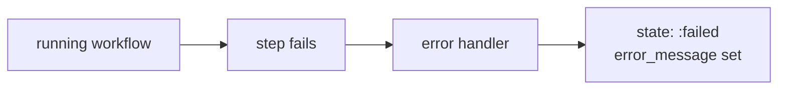

# Workflow error handling — operator documentation

When an AshJobs workflow step fails under an Oban trigger, the workflow should not
vanish into an ambiguous retry loop. The run routes to its configured error
handler, persists an error message, and reaches a terminal `:failed` state that
operators can inspect.

## Stories

| ID        | Story                                                | File                                                              |
| --------- | ---------------------------------------------------- | ----------------------------------------------------------------- |
| US-WEH-02 | Step failures are visible as failed terminal records | [US-WEH-02](./US-WEH-02-failure-visible-terminal-state.md)        |

## See also

- [Developer workflow error handling](../../developer/workflow-error-handling/README.md)
- [failure propagation](../failure-propagation/README.md)
