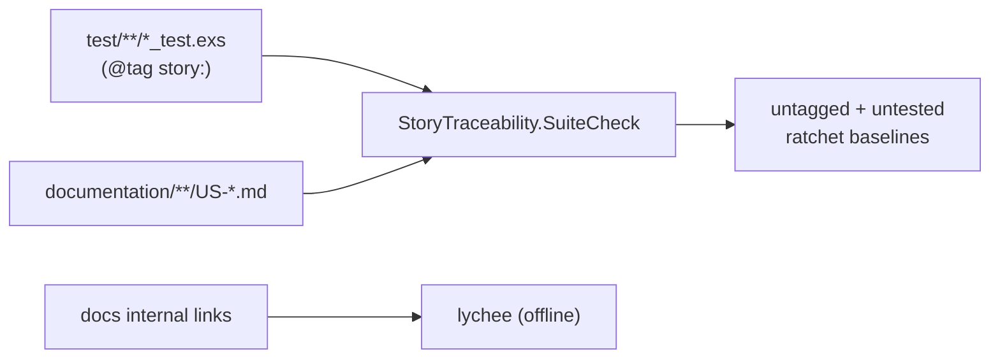

# Documentation conformance — qa-engineer documentation

`ash_jobs` adopts the repo's story↔test traceability gate
(`StoryTraceability.SuiteCheck`) plus lychee internal-link checking: every test
names a story (`@tag story:`), every `US-*` story has a verifying test, an
unknown story tag fails immediately, every story spells out a Given/When/Then,
and every internal documentation link resolves. The two ratchets can only hold
or shrink, driving coverage toward full while never regressing — the same engine
applies to every package we own, only the globs and baseline location differ.

## Stories

| ID        | Story                                                        | File                                                |
| --------- | ------------------------------------------------------------ | --------------------------------------------------- |
| US-DOC-01 | Every test carries a `@tag story:` (untagged ratchet)        | [US-DOC-01](./US-DOC-01-every-test-tagged.md)       |
| US-DOC-02 | Every `US-*` story has a referencing test (untested ratchet) | [US-DOC-02](./US-DOC-02-every-story-tested.md)      |
| US-DOC-03 | A `@tag story:` for a non-existent story fails immediately   | [US-DOC-03](./US-DOC-03-unknown-story-tag-fails.md) |
| US-DOC-04 | A story file with no Given/When/Then fails the gate          | [US-DOC-04](./US-DOC-04-story-missing-gwt-fails.md) |
| US-DOC-05 | Internal documentation links resolve (lychee offline)        | [US-DOC-05](./US-DOC-05-internal-links-resolve.md)  |

## See also

- [documentation-conformance RFC](../../../../../../documentation/rfc/documentation-conformance.md)
- [story-test-sync RFC](../../../../../../documentation/rfc/story-test-sync.md)
- [Workflow DAG engine plan](../../../../../../documentation/plans/workflow-dag-engine.md)
