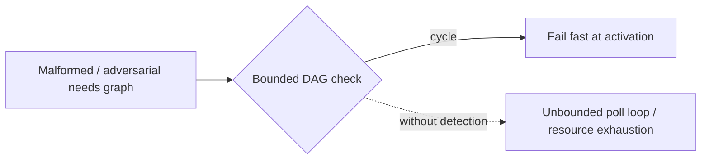

# Runtime cycle detection — security-engineer documentation

A cyclic `needs` graph is a resource-exhaustion vector: without detection the
readiness `where` re-evaluates every scheduler tick forever and rows sit
`:pending` indefinitely, burning poll cycles and holding state. Cycle detection
bounds execution — a single bounded DAG traversal at fan-out fails a malformed
or adversarial `needs` graph fast, so it can't exhaust database or worker
resources or hang the run.

## Stories

| ID        | Story                                                                                         | File                                                      |
| --------- | --------------------------------------------------------------------------------------------- | --------------------------------------------------------- |
| US-CYC-03 | Cycle detection bounds execution — no infinite readiness re-evaluation or resource exhaustion | [US-CYC-03](./US-CYC-03-bound-execution-no-exhaustion.md) |

## See also

- [needs-gated-dag RFC](../../../rfc/needs-gated-dag.md)
- [Workflow DAG engine plan](../../../../../../documentation/plans/workflow-dag-engine.md)
- [Developer cycle-detection docs](../../developer/cycle-detection/README.md)
